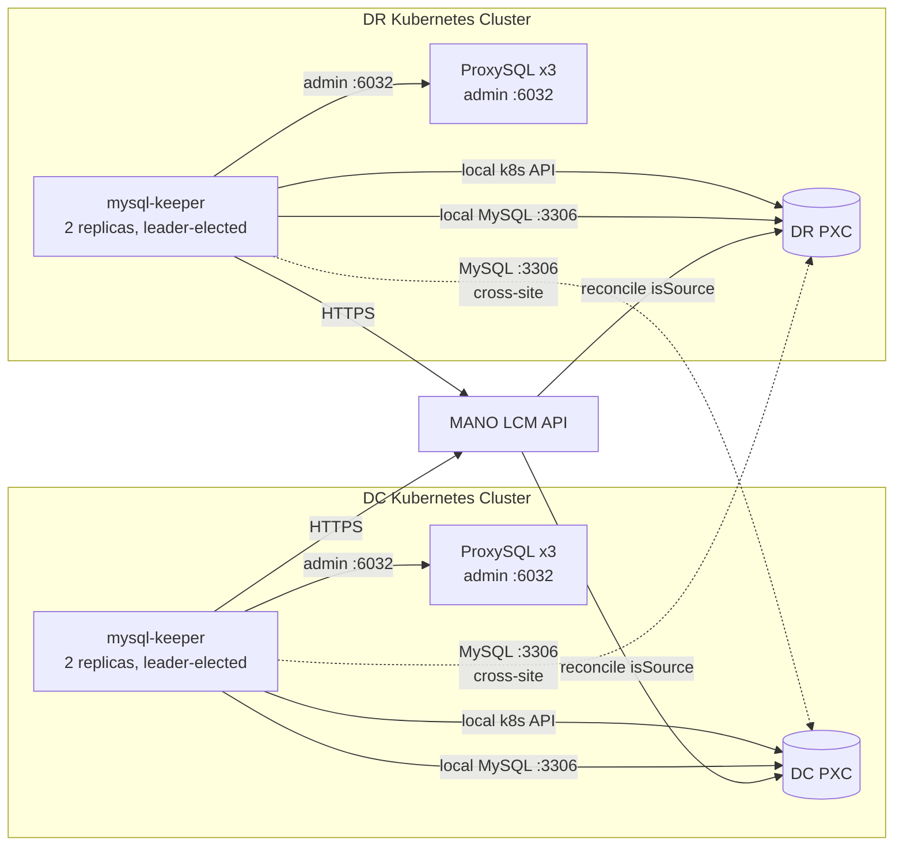
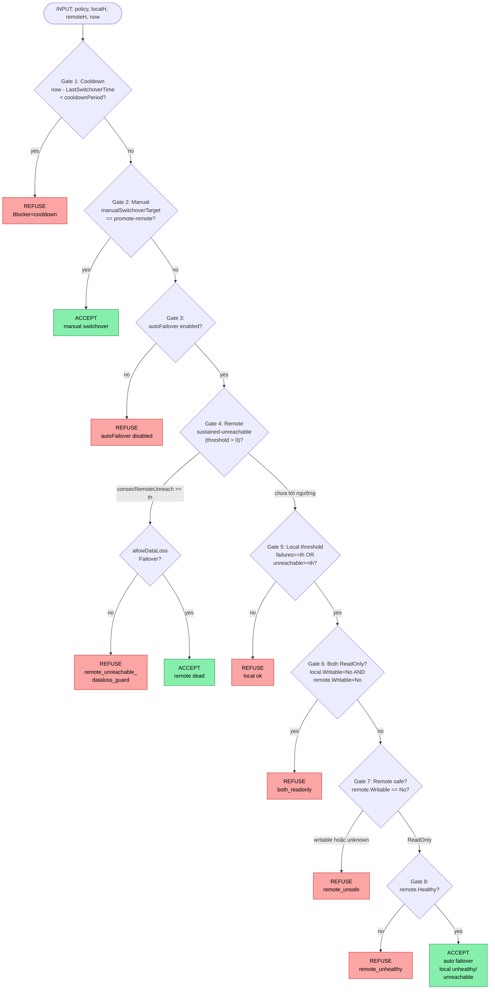
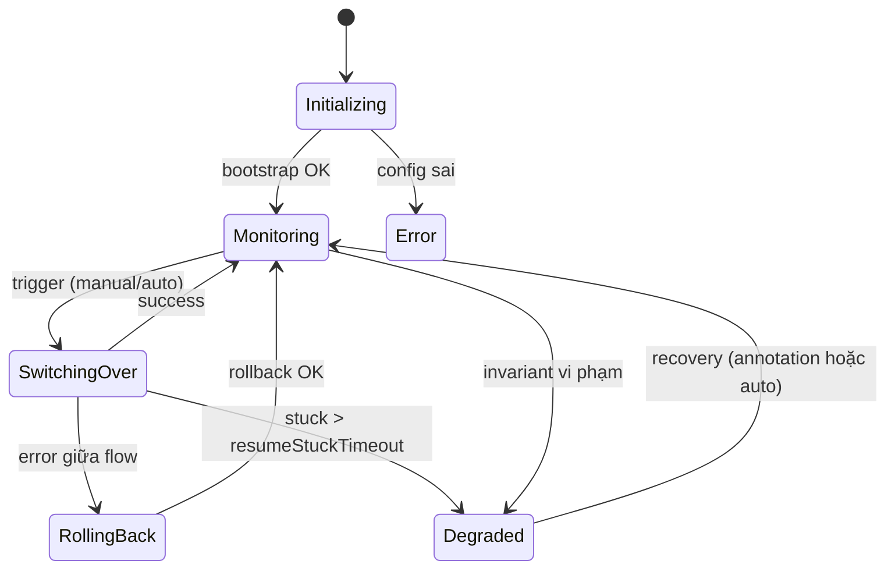

# mysql-keeper — Tóm tắt chức năng

## 1. Mục đích

Kubernetes controller tự động chuyển đổi (failover/switchover) MySQL giữa hai site **DC** và **DR** trên Percona XtraDB Cluster (PXC). Zero-touch failover qua **MANO LCM API**.

## 2. Kiến trúc tổng thể

**Ràng buộc**: API server K8s không reachable cross-cluster. Chỉ MySQL `3306` và ProxySQL admin `6032` chia sẻ giữa DC/DR.

**Ai đổi state?** `isSource` trên PXC CRD chỉ thay đổi qua **MANO** → tránh PXC Operator ghi đè và đảm bảo state survive pod/k8s restart (lưu trong etcd của MANO).

## 3. Thành phần (source tree)

| Package | Chức năng |
|---|---|
| `api/v1alpha1` | CRD `ClusterSwitchPolicy` (spec/status) |
| `internal/controller` | Reconcile loop, **decision.go** (logic failover thuần), finalizer, progress tracking |
| `internal/health` | Health check MySQL (PXC) + ProxySQL, đếm streak failure / unreachable |
| `internal/pxc` | PXC manager, GTID, replication, leader lease |
| `internal/proxysql` | Routing HG10 (write) / HG20 (read) + blackhole fence |
| `internal/mano` | Client MANO: auto-login, refresh token, poll lcm-op-occ |
| `internal/switchover` | Engine: PreFlight → Fence → Promote → Routing → ReverseReplica → Verify (lease + rollback + checkpoint) |
| `internal/metrics` | Prometheus `mysql_keeper_*` |
| `cmd/{main,preflight-cli,switchover-cli}` | Controller binary + 2 CLI debug |
| `test/{e2e,integration}` | E2E + integration tests |

## 4. Health counters (status)

| Counter | Ý nghĩa |
|---|---|
| `consecutiveLocalFailures` | MySQL local **reachable** nhưng state xấu (wsrep non-Primary, quorum mất…) |
| `consecutiveLocalUnreachable` | Không kết nối được local (pod down, TCP refused) |
| `consecutiveRemoteFailures` | Remote reachable nhưng state xấu — chỉ cho metrics/alert, **không** trigger failover |
| `consecutiveRemoteUnreachable` | Remote tắt hoàn toàn (TCP-level) — có thể trigger failover (xem Gate 4) |

## 5. Luồng quyết định failover (`EvaluateSwitchover`)

Hàm thuần (pure function) — không I/O. Đầu vào: `policy`, `localHealth`, `remoteHealth`, `now`. Đầu ra: `{Should, Reason, Blocker}`. Các gate chạy **tuần tự**, dừng ngay khi gặp gate quyết định.

### Diễn giải các gate

| Gate | Điều kiện | Kết quả khi fail | Ghi chú |
|---|---|---|---|
| 1. Cooldown | `now - LastSwitchoverTime ≥ cooldownPeriod` (def **10m**) | Blocker `cooldown` — áp dụng cả manual lẫn auto | Chống ping-pong khi sự cố tạm thời |
| 2. Manual | `manualSwitchoverTarget == promote-remote` | (đi tiếp Gate 3) | Bypass mọi gate auto bên dưới |
| 3. Auto enabled | `spec.autoFailover == true` | Refuse `autoFailover disabled` | |
| 4. Remote unreachable | `remoteUnreachableThreshold > 0` AND `consecutiveRemoteUnreachable ≥ threshold` | Cần `allowDataLossFailover=true` (không verify GTID được) | DR-side promote chính nó khi DC tắt hẳn |
| 5. Local threshold | `failures ≥ th` HOẶC `unreachable ≥ th` | Refuse `local ok` | Trước đây chỉ xét failures → bug "kill local mà không failover" |
| 6. Both ReadOnly | local + remote đều `Writable=No` | Refuse `both_readonly` | Cluster-wide incident → manual triage |
| 7. Remote safe | `remote.Writable == No` (đang ReadOnly) | Refuse `remote_unsafe` | Split-brain guard |
| 8. Remote healthy | `remote.Healthy == true` | Refuse `remote_unhealthy` | Promote vào replica hỏng còn tệ hơn |

### Hai gate **ngoài** hàm pure
- **Peer lease (SQL)** — `internal/pxc/leader_lease.go`: ghi/lấy leader-lease trên MySQL trước flip → tránh 2 controller đồng thời promote.
- **PreFlight checklist** — `internal/switchover/preflight.go`: kiểm tra C1…C11 (replication channel, GTID subset, catch-up, binlog retention…). Hard-check fail → engine abort, transition `Degraded`.

### 3 đường dẫn tới ACCEPT

| Trigger | Điều kiện cần | `allowDataLossFailover`? |
|---|---|---|
| **Manual** | `manualSwitchoverTarget=promote-remote`, không trong cooldown | không cần |
| **Local-failure auto** | `autoFailover=true`, local fail/unreachable ≥ threshold, remote ReadOnly + healthy | không cần |
| **Remote-unreachable auto** | `autoFailover=true`, `remoteUnreachableThreshold>0`, remote im lặng đủ lâu | **bắt buộc true** |

## 6. Phase & Condition

**Conditions**: `LocalClusterHealthy`, `RemoteClusterHealthy`, `SwitchoverInProgress`, `SplitBrainSafe`.

## 7. Tham số mặc định (CRD)

### HealthCheck
| Field | Default | Mô tả |
|---|---|---|
| `interval` | **15s** | Chu kỳ health-check |
| `failureThreshold` | **3** | Số lần fail liên tiếp → unhealthy (≈45s) |
| `mysqlCheckTimeout` | **5s** | Timeout mỗi query MySQL |
| `proxySQLMinHealthy` | **2** | Tối thiểu instance ProxySQL phải up |
| `gtidLagAlertThresholdTransactions` | **0** | 0 = tắt; >0 → emit Warning event khi lag vượt |
| `remoteUnreachableThreshold` | **0** | 0 = tắt; bật cùng `allowDataLossFailover=true` |

### Switchover
| Field | Default | Mô tả |
|---|---|---|
| `timeout` | **5m** | Tổng thời gian switchover trước khi rollback |
| `drainTimeout` | **30s** | Chờ connection drain trước fence (planned) |
| `fenceTimeout` | **10s** | Timeout cho bước fencing |
| `cooldownPeriod` | **10m** | Khoảng tối thiểu giữa 2 switchover |
| `resumeStuckTimeout` | **10m** | SwitchingOver quá lâu → Degraded |
| `crdApplyRetries` | **0** | 0 = chỉ dùng SQL; >0 = patch CRD trước |
| `readWriteHostgroup` | **10** | HG ProxySQL cho write |
| `readOnlyHostgroup` | **20** | HG ProxySQL cho read |
| `blackholeHostgroup` | **9999** | HG fence khi SQL fence fail |
| `remoteWriterPort` | **3306** | Port MySQL remote |

### PreFlight
| Field | Default | Mô tả |
|---|---|---|
| `catchupTimeout` | **30s** | Chờ replica apply hết GTID |
| `minBinlogRetentionSeconds` | **604800** (7 ngày) | Soft warning nếu binlog retention thấp hơn |

### MANO
| Field | Default | Mô tả |
|---|---|---|
| `pollInterval` | **5s** | Tần suất poll lcm-op-occ |
| `pollTimeout` | **5m** | Max chờ COMPLETED |
| `tlsInsecureSkipVerify` | **false** | Chỉ bật khi MANO không có IP SAN |

### Endpoint
| Field | Default |
|---|---|
| MySQL `port` | **3306** |
| ProxySQL `adminPort` | **6032** |

### Top-level
| Field | Default | Mô tả |
|---|---|---|
| `autoFailover` | **true** | Cho phép auto promote khi local fail |
| `allowDataLossFailover` | **false** | Bắt buộc bật cho remote-unreachable path |
| `recovery.autoRecoveryInterval` | **0** | 0 = tắt; dùng annotation `mysql.keeper.io/recover-degraded` để recover |

## 8. Vận hành tóm tắt

1. **Monitoring**: health-check theo `interval`, đếm các counter local/remote.
2. **Auto failover**: khi `EvaluateSwitchover` ACCEPT → engine chạy PreFlight → Fence → Promote → Routing → ReverseReplica → Verify.
3. **Manual switchover**: patch `spec.manualSwitchoverTarget=promote-remote` → graceful (drain trước fence). Controller xóa field này khi xong.
4. **Resume**: checkpoint `SwitchoverProgress` cho phép tiếp tục sau pod restart; quá `resumeStuckTimeout` → `Degraded`.
5. **Recovery khỏi Degraded**: annotation `mysql.keeper.io/recover-degraded` (one-shot) hoặc `recovery.autoRecoveryInterval` (chu kỳ).

## 9. Xem thêm

- [Replication error handling](replication-error-handling.md) — phát hiện lỗi SQL applier, auto-skip, quarantine guard, alarm và metrics
- [Documentation index](README.md) — điều hướng toàn bộ tài liệu
